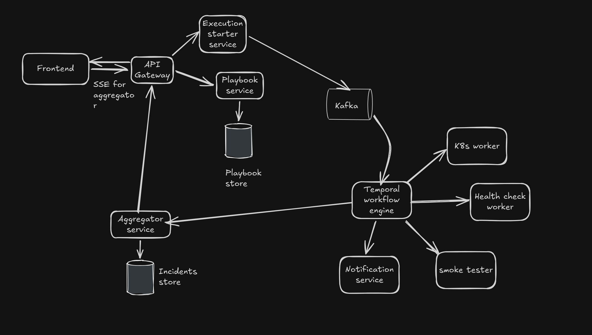

# Kubeaid
Kubeaid is a workflow-driven platform automation engine that allows SREs and Platform engineers to execute operational playbooks (deployments, scaling, health check, end to end smoke test)

## Architecture Diagram

## Tech stack
Frontend: NextJS
Backend services: FastAPI
API Gateway: Kong
Queue system: Kafka
Workflow orchestrator: Temporal

## Note 
For extra added security, this project will be available as a helm chart. Fully air-gapped, this project makes sure that internal data does not reach external cloud providers 
